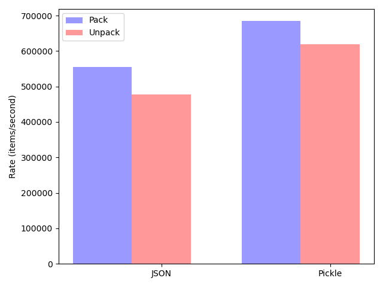

Code from the Python Serialization Benchmark in this [blog
post](http://www.benfrederickson.com/dont-pickle-your-data/), updated
for Python 3, leaving only `pickle` and `json` as the two stdlib
contenders.

Spoiler: in the years since the blog post was written, `pickle` has
become faster than `json` and more competitive in terms of disk usage:

